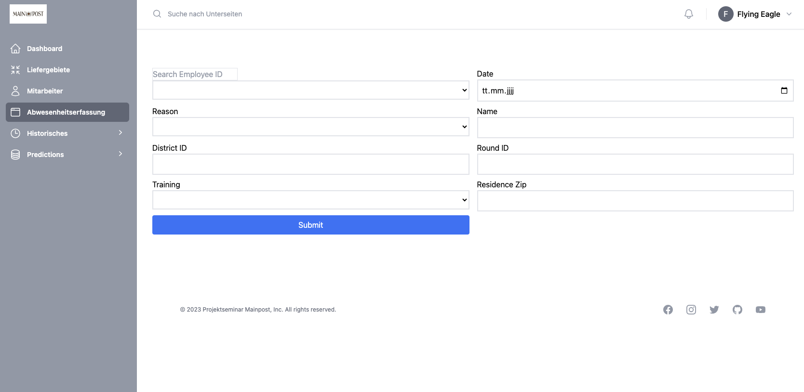

# <i class="fas fa-calendar"></i> Absence Registration 

This component provides a user-friendly interface for recording information on future absences or substitutions.
<br>
The component comprises several steps. Firstly, the employee IDs are retrieved when the page is loaded and displayed dynamically in a drop-down menu. The drop-down list is searchable, which makes it easier to select the employee ID.
<br>
<br>
The actual form contains various input fields such as date, reason, name, district ID, round ID, training and residence ZIP. Error messages for required fields are displayed when filling in the form.
<br>
<br>
The form is submitted using the *createFutureVacancy* method from the *replacementService* module. The form is checked for validity before submission. Error messages are displayed if required fields have not been filled in correctly. Once the form has been successfully submitted, a success message is displayed.
<br>
<br>


[<i class="fas fa-folder"></i> Check out our vue.js VacancyDetection component](https://github.com/UHPDome/backend_mainpost/blob/main/frontend/src/components/Views/Absences/VacancyDetection.vue){:target="_blank"}

---

**The following api queries were executed to extract information about possible replacements of absent employees:**

<details open>
<summary>API queries possible replacements</summary>

```
## find absent employee replacement according to last runners of the specific round
async function findReplacement(round_id)

## perform api call to fastapi-backend to retrieve optimal replacement
async function findOptimalReplacement(date, reason)

## create operation to database to insert new row to future vacancy after filling out form
async function createFutureVacancy(data) 

```
</details>