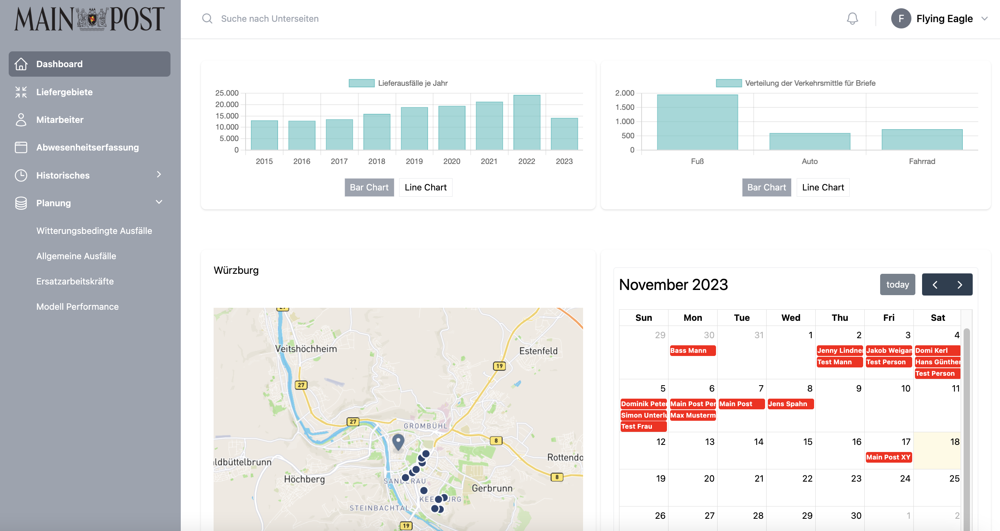

# <i class="fas fa-desktop"></i> Dashboard

The dashboard provides the user with a comprehensive overview of various information and functions. It includes profile information, company details and the status of the user account. To get an initial overview of current figures, "Lieferausfälle je Jahr" and "Verteilung der Verkehrsmittel für Briefe" are loaded on the dashboard in the shape of bar or line charts. Users can choose between the chart types to visualise the data in different ways.
<br>
<br>
The dashboard also contains a map with data on the "Würzburg" location. The points shown provide a graphical overview of the areas in which employees are absent. A calendar is available right next to it, which contains absences listed for the selected month. The calendar can be edited by the user by manually adding absences for individual employees.



<details>
<summary>Check out our vue.js dashboard component </summary>

```
<template>
    <!-- Page header -->
    <div class="bg-white shadow">
        <div class="px-4 sm:px-6 lg:mx-auto lg:max-w-6xl lg:px-8">
          <div class="py-6 md:flex md:items-center md:justify-between lg:border-t lg:border-gray-200">
            <div class="min-w-0 flex-1">
              <!-- Profile -->
              <div class="flex items-center">
                <span class="inline-flex h-16 w-16 items-center justify-center rounded-full bg-gray-500">
                  <div v-if="user">
                    <span class="text-md leading-none text-white">{{ user[0].username.charAt(0).toUpperCase() }}</span>
                  </div>
                </span>           
                <div>
                  <div class="flex items-center">
                    
                    <!-- Wenn die Benutzerdaten geladen wurden, zeige die E-Mail an -->
                    <div v-if="loaded">
                      <h1 class="ml-3 text-2xl font-bold leading-7 text-gray-900 sm:truncate sm:leading-9">Guten Tag, {{user[0].username}}</h1>
                    </div>
                    <!-- Ansonsten zeige eine Ladeanzeige oder eine Meldung an -->
                    <div v-else>
                      Daten werden geladen...
                    </div>
                  </div>
                  <dl class="mt-6 flex flex-col sm:ml-3 sm:mt-1 sm:flex-row sm:flex-wrap">
                    <dt class="sr-only">Company</dt>
                    <dd class="flex items-center text-sm font-medium capitalize text-gray-500 sm:mr-6">
                      <svg class="mr-1.5 h-5 w-5 flex-shrink-0 text-gray-400" viewBox="0 0 20 20" fill="currentColor" aria-hidden="true">
                        <path fill-rule="evenodd" d="M4 16.5v-13h-.25a.75.75 0 010-1.5h12.5a.75.75 0 010 1.5H16v13h.25a.75.75 0 010 1.5h-3.5a.75.75 0 01-.75-.75v-2.5a.75.75 0 00-.75-.75h-2.5a.75.75 0 00-.75.75v2.5a.75.75 0 01-.75.75h-3.5a.75.75 0 010-1.5H4zm3-11a.5.5 0 01.5-.5h1a.5.5 0 01.5.5v1a.5.5 0 01-.5.5h-1a.5.5 0 01-.5-.5v-1zM7.5 9a.5.5 0 00-.5.5v1a.5.5 0 00.5.5h1a.5.5 0 00.5-.5v-1a.5.5 0 00-.5-.5h-1zM11 5.5a.5.5 0 01.5-.5h1a.5.5 0 01.5.5v1a.5.5 0 01-.5.5h-1a.5.5 0 01-.5-.5v-1zm.5 3.5a.5.5 0 00-.5.5v1a.5.5 0 00.5.5h1a.5.5 0 00.5-.5v-1a.5.5 0 00-.5-.5h-1z" clip-rule="evenodd" />
                      </svg>
                      Mainpost GmbH
                    </dd>
                    <dt class="sr-only">Account status</dt>
                    <dd class="mt-3 flex items-center text-sm font-medium capitalize text-gray-500 sm:mr-6 sm:mt-0">
                      <svg class="mr-1.5 h-5 w-5 flex-shrink-0 text-green-400" viewBox="0 0 20 20" fill="currentColor" aria-hidden="true">
                        <path fill-rule="evenodd" d="M10 18a8 8 0 100-16 8 8 0 000 16zm3.857-9.809a.75.75 0 00-1.214-.882l-3.483 4.79-1.88-1.88a.75.75 0 10-1.06 1.061l2.5 2.5a.75.75 0 001.137-.089l4-5.5z" clip-rule="evenodd" />
                      </svg>
                      Verified account
                    </dd>
                  </dl>
                </div>
              </div>
            </div>
          </div>
        </div>
      </div>

      <!-- Start Bereich mit den Cards quick stats -->
      <div class="mt-8">
        

        <h2 class="mx-auto mt-8 max-w-6xl  text-lg font-medium leading-6 text-gray-900 mb-4">Statistiken</h2>

        <div class="grid md:grid-cols-2 space-y-4 md:space-y-0 md:space-x-2 pt-4 md:pt-16">
          <div class="overflow-hidden rounded-lg bg-white shadow">
            <div class="p-5">
              <div v-if="loaded" class="flex items-center w-full">
                  <div class="w-full" v-if="chartType === 'bar'">
                    <SimpleBarChart  :injectedVacancyList="vacanciesPerYear" :injectedLabelList="labels" :injectedLabel="'Lieferausfälle je Jahr'" />
                  </div> 
                  <div class="w-full" v-if="chartType === 'line'">
                    <LineChartVariante  :injectedVacancyList="vacanciesPerYear" :injectedLabelList="labels" :injectedLabel="'Lieferausfälle je Jahr'" />
                  </div>  
              </div>
              <div v-else class="w-full">
                <div class="flex items-center justify-center">
                  <div class="animate-spin rounded-full h-6 w-6 border-t-4 border-gray-500"></div>
                </div>
              </div>
              <div class="flex justify-center mt-4">
                <button class="mr-2 px-2 py-1 text-sm border" :class="{ 'bg-primary-500 text-white': chartType === 'bar' }" @click="setBarChart">Bar Chart</button>
                <button class="px-2 py-1 text-sm border" :class="{ 'bg-primary-500 text-white': chartType === 'line' }" @click="setLineChart">Line Chart</button>
              </div>
            </div>
          </div>
          <div class="overflow-hidden rounded-lg bg-white shadow">
            <div class="p-5">
              <div v-if="loaded_two" class="flex items-center w-full">
                  <div class="w-full" v-if="chartTypeTwo === 'bar'">
                    <SimpleBarChart :injectedVacancyList="counts" :injectedLabelList="labels_two" :injectedLabel="'Verteilung der Verkehrsmittle für Briefe'" />
                  </div> 
                  <div class="w-full" v-if="chartTypeTwo === 'line'">
                    <LineChartVariante  :injectedVacancyList="counts" :injectedLabelList="labels_two" :injectedLabel="'Verteilung der Verkehrsmittle für Briefe'" />
                  </div>  
              </div>
              <div v-else class="w-full">
                <div class="flex items-center justify-center">
                  <div class="animate-spin rounded-full h-6 w-6 border-t-4 border-gray-500"></div>
                </div>
              </div>
              <div class="flex justify-center mt-4">
                <button 
                  class="mr-2 px-2 py-1 text-sm border" 
                  :class="{ 'bg-primary-500 text-white': chartTypeTwo === 'bar' }" 
                  @click="setBarChartTwo">
                    Bar Chart
                </button>
                <button 
                  class="px-2 py-1 text-sm border" 
                  :class="{ 'bg-primary-500 text-white': chartTypeTwo === 'line' }" 
                  @click="setLineChartTwo"
                >
                  Line Chart
                </button>
              </div>
            </div>
          </div>          
        </div>
        <div class="grid md:grid-cols-2 space-y-4 md:space-y-0 md:space-x-2 pt-4 md:pt-16">
          <div class="overflow-hidden rounded-lg bg-white shadow">
            <div class="p-5">
                <div v-if="loaded_two" class="flex items-center w-full">
                  <MapComponent :location="'Würzburg'" :zip="'97070'"/>
                </div>
                <div v-else class="w-full">
                  <div class="flex items-center justify-center">
                    <div class="animate-spin rounded-full h-6 w-6 border-t-4 border-gray-500"></div>
                  </div>
                </div>
            </div>
          </div>
          <div class="overflow-hidden rounded-lg bg-white shadow">
            <div class="p-5">
                <div class="items-center w-full">
                  <div v-if="loaded_two" class="items-center w-full flex flex-col">
                    <DashboardCalendarComponent />
                    <a 
                      href="/employees/employee-allocation"
                      class="py-2 px-4 bg-primary-500 text-white hover:bg-primary-800 mt-4 items-center max-w-sm mx-auto justify-center rounded-lg"> 
                        Zur Detailansicht 
                    </a>
                  </div>
                  <div v-else class="w-full">
                    <div class="flex items-center justify-center">
                      <div class="animate-spin rounded-full h-6 w-6 border-t-4 border-gray-500"></div>
                    </div>
                  </div>
                </div>
            </div>
          </div>
          
        </div>
    </div>
    <!-- Ende Bereich Cards und Tabelle -->
</template>


<script>
  import userService from '@/services/Users/userService';
  import SimpleBarChart from '@/components/SubComponents/Charts/BarCharts/SimpleBarChart';
  import { getVacanciesPerYear } from '@/services/Vacancies/vacancyService.js'
  import { ref } from 'vue';
  import { getVehicleLetterCounts} from '@/services/Districts/districtService.js'
  import MapComponent from '@/components/SubComponents/Map/MapComponent'
  import DashboardCalendarComponent from '@/components/SubComponents/Calendar/DashboardCalendarComponent'
  import LineChartVariante from '@/components/SubComponents/Charts/LineCharts/LineChartVariante.vue';

  export default {
    data() {
      return {
        user: ref(null),
        vacanciesPerYear: [],
        labels: [], 
        label: "", 
        loaded: false,
        counts: [],
        loaded_two: false,
        labels_two: [],
        chartType: 'bar',
        chartTypeTwo: 'bar',
      };
    },
    mounted() {
     this.loadData();
    },
    methods: {
      async loadData() {
        this.counts = await getVehicleLetterCounts();
        this.counts = await this.cleanData(this.counts);
        console.log(this.counts);
        this.labels_two = ["Fuß", "Auto", "Fahrrad"];
        this.loaded_two = true;
        this.user = await userService.fetchLoggedUser();
        this.vacancies2015 = await getVacanciesPerYear("2015");
        this.vacancies2016 = await getVacanciesPerYear("2016");
        this.vacancies2017 = await getVacanciesPerYear("2017");
        this.vacancies2018 = await getVacanciesPerYear("2018");
        this.vacancies2019 = await getVacanciesPerYear("2019");
        this.vacancies2020 = await getVacanciesPerYear("2020");
        this.vacancies2021 = await getVacanciesPerYear("2021");
        this.vacancies2022 = await getVacanciesPerYear("2022");
        this.vacancies2023 = await getVacanciesPerYear("2023");
        
        this.labels = ['2015','2016', '2017', '2018','2019', '2020', '2021', '2022', '2023'];
        
        this.vacanciesPerYear = await Promise.all(this.labels.map(async (year) => {
          return await getVacanciesPerYear(year);
        }));
        console.log(this.vacanciesPerYear);
        this.loaded = true;
        
      },
      setBarChart() {
        this.chartType = 'bar';
      },
      setLineChart() {
        this.chartType = 'line';
      },
      setBarChartTwo() {
        this.chartTypeTwo = 'bar';
      },
      setLineChartTwo() {
        this.chartTypeTwo = 'line';
      },
      cleanData(dataArray) {
          let aggregatedCounts = {
            'Fuß': 0,
            'Fahrrad': 0,
            'Auto': 0
        };

        // Loop through the dataArray 
        dataArray.forEach(item => {
            if (item.type && item.type.startsWith('Fuß')) {
                aggregatedCounts['Fuß'] += item.count;
            } else if (item.type && item.type.startsWith('Fahrrad')) {
                aggregatedCounts['Fahrrad'] += item.count;
            } else if (item.type && item.type.startsWith('Auto')) {
                aggregatedCounts['Auto'] += item.count;
            }
        });

        // Convert aggregatedCounts object to array
        let result = Object.keys(aggregatedCounts).map(key => ({ type: key, count: aggregatedCounts[key] }));
        result.forEach((item, index) => {
          result[index] = item.count;
      });

      return result;
      }
    },
    components: {
      SimpleBarChart,
      MapComponent,
      DashboardCalendarComponent,
      LineChartVariante,
    },
  };
</script>

```
</details>


