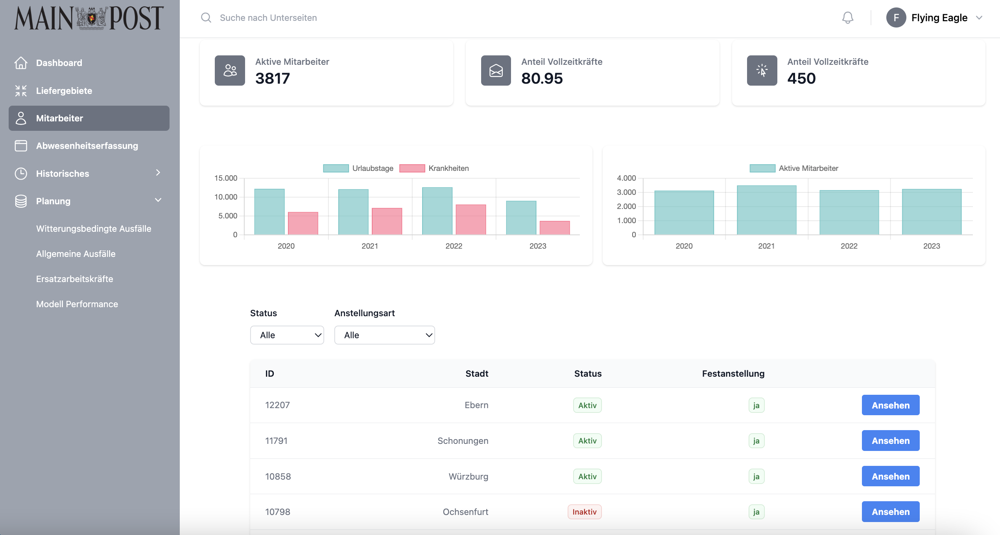
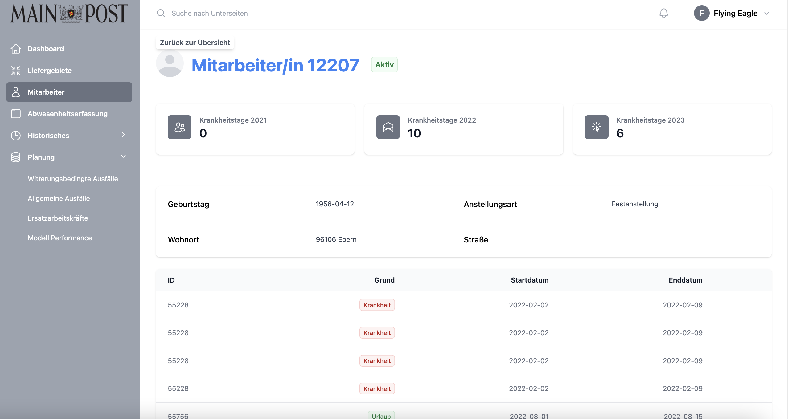

# <i class="fas fa-user"></i> Employees
## Employee List
The page provides an overview of employee statistics, including the number of active employees, the proportion of full-time employees and other relevant key figures. 
<br>
The main view shows two bar charts that visualise the distribution of employees and the yearly development. There is also a table of employees that can be filtered by status, employment type and other criteria. Each employee is represented by a line with ID, city, status and employment type. The table contains a pagination function for easy navigation through the data records.



[<i class="fas fa-folder"></i> Check out our vue.js EmployeeList component](https://github.com/UHPDome/backend_mainpost/blob/main/frontend/src/components/Views/Employees/index/EmployeeList.vue){:target="_blank"}

---

## Employee Details
This page displays detailed information on a specific employee. 
<br>
If the employee is active, further statistics on sick days in 2021, 2022 and 2023 are displayed. A list of employee information, including birthday, employment type, place of residence and street, is also available.
<br>
In addition, there is a table that lists the employee's absences (holiday or illness). The table is displayed either with the relevant data or an empty list, depending on whether the employee has absences.





[<i class="fas fa-folder"></i> Check out our vue.js EmployeeDetail component](https://github.com/UHPDome/backend_mainpost/blob/main/frontend/src/components/Views/Employees/show/EmployeeDetail.vue){:target="_blank"}

---

**The following database queries were executed to extract employee information:**

<details open>
<summary>Database query employee information</summary>

```
## get all employees between index > startNumber & index < endNumber
async function fetchEmployees(startNumber, endNumber) 

## get all active Employees of Year xx
async function getActiveEmployeesInYear(year)

## get all employees according to max 2 filters
async function fetchFilteredEmployees(startNumber, endNumber, filterOne = null, filterTwo = null)

## get num of employees according to filters
async function getEmployeeCount(filter = null, filter_two = null) 

## get all vacant employees from date to another date
async function getFutureVacancies(from, to)

## get employee ids
async function fetchEmployeeIds() 

```
</details>