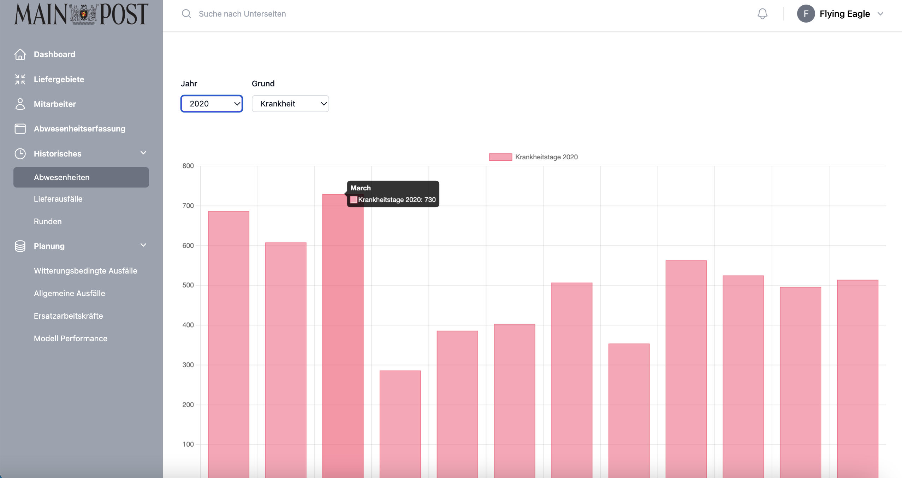
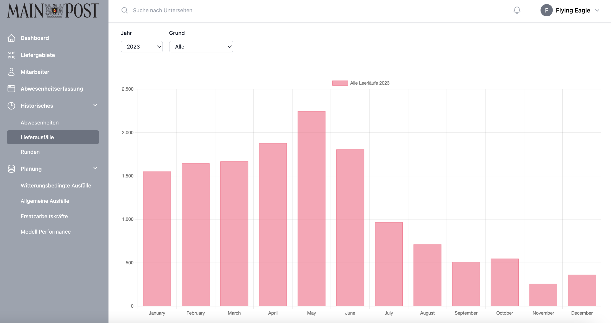
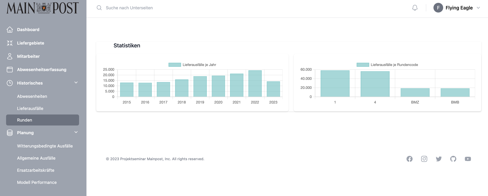

# <i class="fas fa-clock"></i> Historisches
<span style="color:red;">Einleitung für diese Kapitel einfügen</span>


## Abwesenheiten
This component displays a chart of monthly employee absences based on the selected year and reason (holiday or sickness). Users can select the year and reason via drop-down lists. The Chart.js library is used to create an interactive bar chart that visualises the monthly absences for the selected year and reason.



<br>
<br>
<details>
<summary>Check out our vue.js MonthlyAbsences component</summary>

```
<template>
    <div v-if="loaded" class="flex flex-wrap space-y-0 space-x-4 w-full sm:w-1/2">
        <div>
            <label for="year" class="block text-sm font-medium leading-6 text-gray-900">
            Jahr
            </label>
            <select
                id="year"
                name="year"
                v-model="year" 
                @change="onYearChange"
                class="mt-2 block w-full rounded-md border-0 py-1.5 pl-3 pr-10 text-gray-900 ring-1 ring-inset ring-gray-300 focus:ring-2 focus:ring-indigo-600 sm:text-sm sm:leading-6"
            >
            <option value="2020">2020</option>
            <option value="2021">2021</option>
            <option value="2022">2022</option>
            <option value="2023">2023</option>
            </select>
        </div>
        <div>
            <label for="reason" class="block text-sm font-medium leading-6 text-gray-900">
            Grund
            </label>
            <select
            id="reason"
            name="reason"
            v-model="reason" 
            @change="onReasonChange"
            class="mt-2 block w-full rounded-md border-0 py-1.5 pl-3 pr-10 text-gray-900 ring-1 ring-inset ring-gray-300 focus:ring-2 focus:ring-indigo-600 sm:text-sm sm:leading-6"
            >
            <option value="vacation">Urlaub</option>
            <option value="illness">Krankheit</option>
            </select>
        </div>
    </div>
    <div  class="w-full mt-16" v-if="loadedChart">
        <canvas ref="barChartCanvas" class="w-full h-fit"/>
    </div>
    <div class="mt-16" v-else>
        <div class="flex items-center justify-center">
            <div class="animate-spin rounded-full h-6 w-6 border-t-4 border-gray-500"></div>
        </div>
    </div>
</template>

<script>
import { getMonthlyAbsencesInYear } from '@/services/Absences/absencesService';
import Chart from 'chart.js/auto';

export default {
  data() {
    return {
      absences: [],
      monthNames: [
        'January', 'February', 'March', 'April', 'May', 'June',
        'July', 'August', 'September', 'October', 'November', 'December',
        ],
      reason: '',
      year: '',
      loaded: false,
      chart: null,
      loadedChart: false,
    };
  },
  created() {
    if (this.chart) {
        this.chart.destroy();
    }
    this.loadData();
  },

  methods: {
    
    async onYearChange() {
      if (this.chart) {
        this.chart.destroy();
      }

      // Update the URL with the new selected year and reason
      await this.$router.push({ query: { reason: this.reason, year: this.year } });

      // Ensure that the chart is only created after the route is updated and the data is loaded
      this.$nextTick(() => {
        this.loadData();
      });
    },
    async onReasonChange() {
      if (this.chart) {
        this.chart.destroy();
      }

      // Update the URL with the new selected year and reason
      await this.$router.push({ query: { reason: this.reason, year: this.year } });

      // Ensure that the chart is only created after the route is updated and the data is loaded
      this.$nextTick(() => {
        this.loadData();
      });
    },
    async loadData() {
        this.loadedChart = false;
        // Retrieve the reason and year from the route query
        if (this.$route.query.reason) {
            this.reason = this.$route.query.reason;
        } else {
            this.reason = "illness";
        }
        if (this.$route.query.year) {
            this.year = this.$route.query.year;
        } else {
            this.year = "2020";
        }
        // Use this.reason and this.year in your API call or any other logic
        // to load data based on the selected reason and year.
        try {
            for (let i = 1; i <= 12; i++) {
            this.absences[i] = await getMonthlyAbsencesInYear(this.reason, this.year, i);
            }
            console.log(this.absences);
        } catch (error) {
            console.error('Fehler beim Laden der Daten:', error);
        }
        this.loadedChart = true;
        // Wait for the next tick to ensure that the canvas element is rendered
        this.$nextTick(() => {
            this.createBarChart();
        });
    },
    async createBarChart() {
        this.loaded = false;
        const months = Object.keys(this.absences).map(Number);
        const absenceCounts = Object.values(this.absences);
        // Map the numeric months to month names
        const monthLabels = months.map(month => this.monthNames[month - 1]);
        const ctx = this.$refs.barChartCanvas.getContext('2d');

        let headlineText;
        if (this.reason == "vacation") {
            headlineText = "Urlaubstage";
        } else {
            headlineText = "Krankheitstage";
        }

        let colorGradient;
        let colorBorder;
        if (this.reason == "vacation") {
            colorGradient = 'rgba(75, 192, 192, 0.6)';
            colorBorder = 'rgba(75, 192, 192, 1)';
        } else {
            colorGradient = 'rgba(255, 99, 132, 0.6)';
            colorBorder = 'rgba(255, 99, 132, 1)';
        }
        this.chart = new Chart(ctx, {
            type: 'bar',
            data: {
            labels: monthLabels,
            datasets: [
                {
                label: headlineText+ " " + this.year,
                backgroundColor: colorGradient,
                borderColor: colorBorder,
                borderWidth: 1,
                data: absenceCounts,
                },
            ],
            },
            options: {
            responsive: true,
            maintainAspectRatio: false,
            scales: {
                y: {
                beginAtZero: true,
                },
            },
            },
        });
        this.loaded = true;
    },
  },
};

</script>

```
</details>

## Lieferausfälle
This component shows a chart of monthly failures related to failed deliveries for a selected year and a selected reason (holiday, illness or not delivered). Users can select the year and reason via drop-down lists. The chart is also created with Chart.js and visualises the monthly downtime for the selected year and reason.
<br>
<br>

<br>
<br>
<details>
<summary>Check out our vue.js YearlyVacancies component</summary>

```
<template>
    <div v-if="loaded" class="flex flex-wrap space-y-0 space-x-4 w-full sm:w-1/2">
        <div>
            <label for="year" class="block text-sm font-medium leading-6 text-gray-900">
            Jahr
            </label>
            <select
                id="year"
                name="year"
                v-model="year" 
                @change="onYearChange"
                class="mt-2 block w-full rounded-md border-0 py-1.5 pl-3 pr-10 text-gray-900 ring-1 ring-inset ring-gray-300 focus:ring-2 focus:ring-indigo-600 sm:text-sm sm:leading-6"
            >
                <option value="2015">2015</option>
                <option value="2016">2016</option>
                <option value="2017">2017</option>
                <option value="2018">2018</option>
                <option value="2019">2019</option>
                <option value="2020">2020</option>
                <option value="2021">2021</option>
                <option value="2022">2022</option>
                <option value="2023">2023</option>
            </select>
        </div>
        <div>
            <label for="reason" class="block text-sm font-medium leading-6 text-gray-900">
            Grund
            </label>
            <select
            id="reason"
            name="reason"
            v-model="reason" 
            @change="onReasonChange"
            class="mt-2 block w-full rounded-md border-0 py-1.5 pl-3 pr-10 text-gray-900 ring-1 ring-inset ring-gray-300 focus:ring-2 focus:ring-indigo-600 sm:text-sm sm:leading-6"
            >
            <option value="all">Alle</option>
            <option value="vacation">Urlaub</option>
            <option value="illness">Krankheit</option>
            <option value="not-delivered">Nicht geliefert</option>
            </select>
        </div>
    </div>
    <div  class="w-full mt-16" v-if="loadedChart">
        <canvas ref="barChartCanvas" class="w-full h-fit"/>
    </div>
    <div class="mt-16" v-else>
        <div class="flex items-center justify-center">
            <div class="animate-spin rounded-full h-6 w-6 border-t-4 border-gray-500"></div>
        </div>
    </div>
</template>

<script>
import { getMonthlyVacanciesInYear } from '@/services/Vacancies/vacancyService';
import Chart from 'chart.js/auto';

export default {
  data() {
    return {
      absences: [],
      monthNames: [
        'January', 'February', 'March', 'April', 'May', 'June',
        'July', 'August', 'September', 'October', 'November', 'December',
        ],
      reason: '',
      year: '',
      loaded: false,
      chart: null,
      loadedChart: false,
    };
  },
  created() {
    if (this.chart) {
        this.chart.destroy();
    }
    this.loadData();
  },

  methods: {
    
    async onYearChange() {
      if (this.chart) {
        this.chart.destroy();
      }
      // Update the URL with the new selected year and reason
      await this.$router.push({ query: { reason: this.reason, year: this.year } });

      // Ensure that the chart is only created after the route is updated and the data is loaded
      this.$nextTick(() => {
        this.loadData();
      });
    },
    async onReasonChange() {
      if (this.chart) {
        this.chart.destroy();
      }
      // Update the URL with the new selected year and reason
      await this.$router.push({ query: { reason: this.reason, year: this.year } });

      // Ensure that the chart is only created after the route is updated and the data is loaded
      this.$nextTick(() => {
        this.loadData();
      });
    },
    async loadData() {
        this.loadedChart = false;
        // Retrieve the reason and year from the route query
        if (this.$route.query.reason) {
            this.reason = this.$route.query.reason;
        } else {
            this.reason = "all";
        }
        if (this.$route.query.year) {
            this.year = this.$route.query.year;
        } else {
            this.year = "2020";
        }
        // console.log(this.reason);
        // Use this.reason and this.year in your API call or any other logic
        // to load data based on the selected reason and year.
        try {
            for (let i = 1; i <= 12; i++) {
            this.absences[i] = await getMonthlyVacanciesInYear(this.reason, this.year, i);
            }
            console.log(this.absences);
        } catch (error) {
            console.error('Fehler beim Laden der Daten:', error);
        }
        this.loadedChart = true;
        // Wait for the next tick to ensure that the canvas element is rendered
        this.$nextTick(() => {
            this.createBarChart();
        });
    },
    async createBarChart() {
        this.loaded = false;
        const months = Object.keys(this.absences).map(Number);
        const absenceCounts = Object.values(this.absences);
        // Map the numeric months to month names
        const monthLabels = months.map(month => this.monthNames[month - 1]);
        const ctx = this.$refs.barChartCanvas.getContext('2d');

        let headlineText;
        if (this.reason == "vacation") {
            headlineText = "Urlaubsbedingte Leerläufe";
        } else if (this.reason == "illnes"){
            headlineText = "Krankheitsbedingte Leerläufe";
        } else if (this.reason == "not-delivered"){
            headlineText = "Sonstige Leerläufe";
        } else {
            headlineText = "Alle Leerläufe";
        }

        let colorGradient;
        let colorBorder;
        if (this.reason == "vacation") {
            colorGradient = 'rgba(75, 192, 192, 0.6)';
            colorBorder = 'rgba(75, 192, 192, 1)';
        } else {
            colorGradient = 'rgba(255, 99, 132, 0.6)';
            colorBorder = 'rgba(255, 99, 132, 1)';
        }
        this.chart = new Chart(ctx, {
            type: 'bar',
            data: {
            labels: monthLabels,
            datasets: [
                {
                label: headlineText+ " " + this.year,
                backgroundColor: colorGradient,
                borderColor: colorBorder,
                borderWidth: 1,
                data: absenceCounts,
                },
            ],
            },
            options: {
            responsive: true,
            maintainAspectRatio: false,
            scales: {
                y: {
                beginAtZero: true,
                },
            },
            },
        });
        this.loaded = true;
    },
  },
};

</script>

```
</details>

## Runden
This Vue.js component creates a page with statistics that contains two charts. The statistics show delivery failures per year and delivery failures per round code.
<br>
<br>

<br>
<br>
<details>
<summary>Check out our vue.js RoundStatistics component</summary>

```
<template>
    <!-- Page header -->
    <div class="bg-white shadow">
      <!-- Start Bereich mit den Cards quick stats -->

        <h2 class="mx-auto mt-8 max-w-6xl  text-lg font-medium leading-6 text-gray-900 mb-4">Statistiken</h2>

        <div class="grid md:grid-cols-2 space-x-0 md:space-x-4 space-y-4 md:space-y-0">
          <div class="overflow-hidden rounded-lg bg-white shadow">
            <div class="p-5">
                <div v-if="loaded" class="flex items-center">
                  <SimpleBarChart :injectedVacancyList="vacanciesPerYear" :injectedLabelList="labels" :injectedLabel="'Lieferausfälle je Jahr'" />
                </div>
                <div v-else class="w-full">
                  <div class="flex items-center justify-center">
                    <div class="animate-spin rounded-full h-6 w-6 border-t-4 border-gray-500"></div>
                  </div>
                </div>
            </div>
          </div>
          <div class="overflow-hidden rounded-lg bg-white shadow">
            <div class="p-5">
              <div v-if="loaded" class="flex items-center">
                  <SimpleBarChart 
                    :injectedVacancyList="vacanciesPerRound" 
                    :injectedLabelList="round_labels" 
                    :injectedLabel="'Lieferausfälle je Rundencode'"
                  />
                </div>
                <div v-else class="w-full">
                  <div class="flex items-center justify-center">
                    <div class="animate-spin rounded-full h-6 w-6 border-t-4 border-gray-500"></div>
                  </div>
                </div>
            </div>
          </div>
        </div>
    </div>
    <!-- Ende Bereich Cards und Tabelle -->
</template>


<script>
  import SimpleBarChart from '@/components/SubComponents/Charts/BarCharts/SimpleBarChart';
  import { getVacanciesPerYear } from '@/services/Vacancies/vacancyService.js'
  import { ref } from 'vue';
  import { getVacanciesPerRound } from '@/services/Rounds/roundService.js';
 
  export default {
    data() {
      return {
        user: ref(null),
        vacanciesPerYear: [],
        labels: [], 
        label: "", 
        loaded: false,
        vacanciesPerRound: [],
        round_labels: [],
      };
    },
    mounted() {
     this.loadData();
    },
    methods: {
      async loadData() {
       this.labels = ['2015','2016', '2017', '2018','2019', '2020', '2021', '2022', '2023'];
       this.vacanciesPerYear = await Promise.all(this.labels.map(async (year) => {
        return await getVacanciesPerYear(year);
      }));
      this.round_labels = ["1", "4", "BMZ", "BMB"]
      this.vacanciesPerRound = await Promise.all(this.round_labels.map(async (round) => {
        return await getVacanciesPerRound(round);
      }));
      this.loaded = true;
      },
    },
    components: {
      SimpleBarChart,
    },
  };
</script>

```
</details>