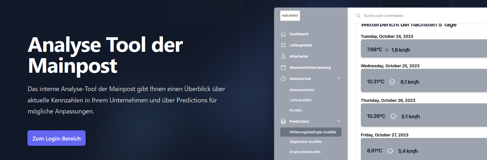

# <i class="fas fa-plane-arrival"></i> Landing Page
The static HTML landing page offers users a concise overview of the application. The functions, the technology stack used and access to the login area are clearly presented here. After logging out of the application, users are automatically redirected to this page.
 
 

