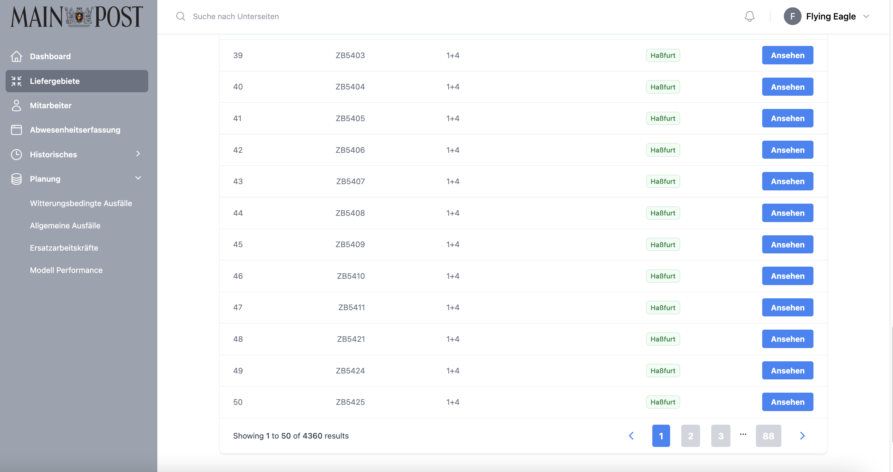
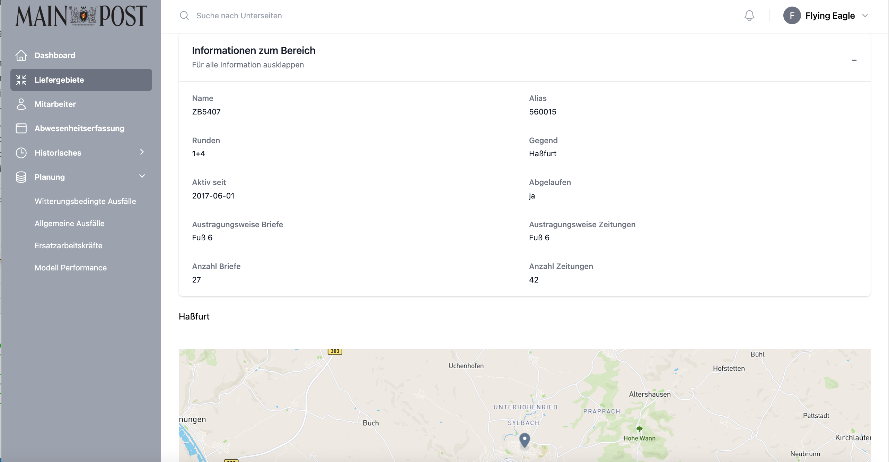

# <i class="fas fa-truck"></i> Liefergebiete
## District List

This page provides the user with a table containing information on various districts. Each record in the table represents a district with corresponding details. The "Ansehen" button takes the user to a detailed view of a specific district.
The table is paginated, which means that only a limited number of data records are displayed at once. Below the table is a navigation bar with page numbers and navigation arrows to scroll through the pages and view more districts. The user can switch between pages to view different records.



[<i class="fas fa-folder"></i> Check out our vue.js DistrictList component](https://github.com/UHPDome/backend_mainpost/blob/main/frontend/src/components/Views/Districts/index/DistrictList.vue){:target="_blank"}

---

## District Details

The page displays detailed information about a specific district, including name, alias, number of laps, geographic area, activation date and more. This information is clearly organised in info boxes. There is also a map component that visually displays the geographic location of the district. This allows the user to get both textual and visual insights into the selected district.
<br>
<br>



[<i class="fas fa-folder"></i> Check out our vue.js DistrictDetail component](https://github.com/UHPDome/backend_mainpost/blob/main/frontend/src/components/Views/Districts/show/DistrictDetail.vue){:target="_blank"}

---

**The following database queries were executed to extract district information:**

<details open>
<summary>Database query district information</summary>
```
## get all districts between index > startNumber & index < endNumber
async function getAllDistricts(startNumber, endNumber)

## get specific district information for detailview
async function getSpecificDistrict(districtId) 

## get num of districts with max 2 filters
async function getDistrictCount(filter = null, filter_two = null) 

## get zip codes of one specific District
async function getZipsOfDistrict(districtId)

## get count of different vehicle types with which letters get carried out
async function getVehicleLetterCounts()

## get all 16 area codes 
export async function getAllAreas()

```
</details>
