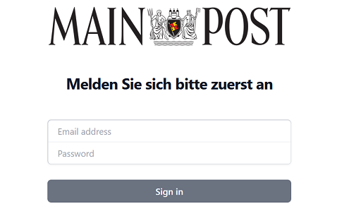

# <i class="fas fa-lock"></i>  Login
After all container are started, you can login to the application on [Netlify](https://mainpost-projektseminar.netlify.app/). Login with you credentials. Your username is the first letter of the name and the full surename.
<br>
<br>



The login process is performed using the loginWithSupabase method, which uses the Supabase authentication services and redirects to the /dashboard page if the login is successful.

<details>
<summary>Check out our vue.js login component </summary>

```
<!-- Coponent for frontend -> /login -->
<template>
  <div class="flex min-h-full items-center justify-center px-4 py-12 sm:px-6 lg:px-8">
    <div class="w-full max-w-sm space-y-10">
      <div>
        
        <h2 class="mt-10 text-center text-2xl font-bold leading-9 tracking-tight text-gray-900">Melden Sie sich bitte zuerst an</h2>
      </div>
      <form class="space-y-6" @submit.prevent="loginWithSupabase">
          <div class="relative -space-y-px rounded-md shadow-sm">
            <div class="pointer-events-none absolute inset-0 z-10 rounded-md ring-1 ring-inset ring-gray-300"></div>
            <div class="">
              <label for="email-address" class="sr-only">Email address</label>
              <input
                id="email-address"
                name="email"
                type="email"
                autocomplete="email"
                required
                v-model="email"
                class="relative px-4 block w-full rounded-t-md border-0 py-1.5 text-gray-900 ring-1 ring-inset ring-gray-100 placeholder:text-gray-400 focus:z-10 focus:ring-2 focus:ring-inset focus:ring-indigo-600 sm:text-sm sm:leading-6"
                placeholder="Email address"
              >
            </div>
            <div>
              <label for="password" class="sr-only">Password</label>
              <input
                id="password"
                name="password"
                type="password"
                autocomplete="current-password"
                required
                v-model="password"
                class="relative block w-full px-4 rounded-b-md border-0 py-1.5 text-gray-900 ring-1 ring-inset ring-gray-100 placeholder:text-gray-400 focus:z-10 focus:ring-2 focus:ring-inset focus:ring-indigo-600 sm:text-sm sm:leading-6"
                placeholder="Password"
              >
            </div>
          </div>

          <div>
            <button type="submit" class="flex w-full justify-center rounded-md bg-primary-600 px-3 py-1.5 text-sm font-semibold leading-6 text-white hover:bg-opacity-90 focus-visible:outline focus-visible:outline-2 focus-visible:outline-offset-2 focus-visible:outline-primary-600">Sign in</button>
          </div>
      </form>

    </div>
  </div>

</template>


<script>
import supabase from '@/services/supabase';  // Passe den Pfad entsprechend an


export default {
    data() {
        return {
        email: '',
        password: '',
        };
    },
    // Check if user is authenticated by establishing conn to supabase (check pw and username)
    methods: {
        async loginWithSupabase() {
            try {
                const { data, error } = await supabase.auth.signInWithPassword({
                    email: this.email,
                    password: this.password,
                });

                if (error) {
                console.error('Fehler beim Anmelden:', error.message);
                } else {
                  console.log('Anmeldung erfolgreich:', data);
                  window.location.href = '/dashboard';
                }
            } catch (error) {
                console.error('Unbekannter Fehler:', error);
            }
        },
    },
};
</script>

```
</details>
