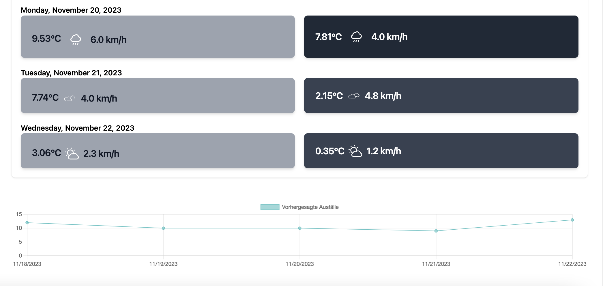
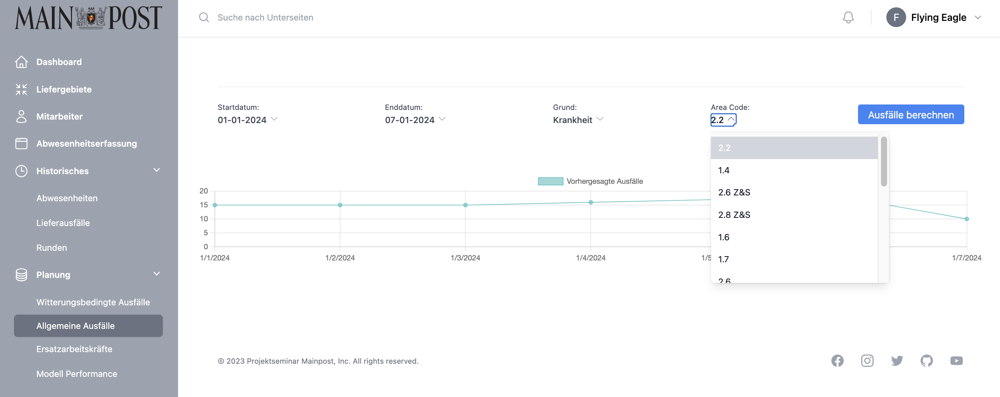
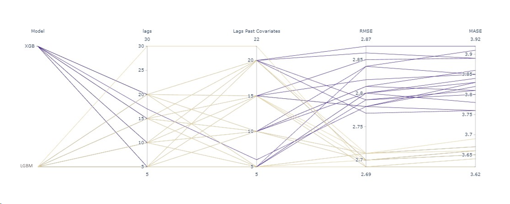
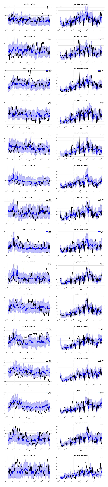

# <i class="fas fa-database"></i> Planning
Our platform provides a comprehensive picture of various aspects, starting with <span style="background-color: #0284c7;">**Weather-Related Cancellations**</span>, where advanced forecasting models and real-time weather data support advanced proactive measures to manage outages. <span style="background-color: #0284c7;">**General Outages**</span> provides strategic insights into long-term outage forecasts, while <span style="background-color: #0284c7;">**Substitute Workers**</span> enables real-time tracking of employee absences and efficient replacement planning. These approaches are designed to optimise processes and improve the organisation's adaptability.
<br>
To conclude, the <span style="background-color: #0284c7;">**Model Performance**</span> section provides a holistic view of our platform by enabling users to thoroughly test the effectiveness of the implemented machine learning models.

## Weather-Related Cancellations
In this predictive view, an advanced model with multiple time series forecasts outages for the next five days. Real-time weather data from OpenWeatherMap is seamlessly integrated, providing valuable insight into weather conditions and their impact on outages.

The user-friendly interface can be customised by selecting one of 16 different areas via a drop-down menu. This feature allows users to focus on specific geographic regions, making it easier to implement targeted proactive measures in response to expected outage patterns.

The user interface provides a dual forecast: a comprehensive weather forecast for the next five days and a visual representation of expected outages based on correlated weather conditions. This forecast is presented through an intuitive line graph that helps users recognise patterns and make informed decisions.

By integrating state-of-the-art forecasting models with real-time weather data, our platform not only improves the accuracy of outage prediction, but also empowers users with the knowledge to proactively address potential issues. This integrated approach encourages a proactive response to outage scenarios and contributes to a more resilient and better prepared infrastructure.
<br>
<br>

<br>
<br>
[<i class="fas fa-folder"></i> Check out our vue.js VacancyPrediction component](https://github.com/UHPDome/backend_mainpost/blob/main/frontend/src/components/Views/Vacancies/VacancyPrediction.vue){:target="_blank"}


## General Outages

In this advanced forecast view, users are provided with the ability to forecast outages up to three years into the future, providing strategic insights for long-term planning. <br> <br>
It is important to emphasise that weather-related considerations are excluded due to the inherent unpredictability over longer periods of time. The view includes filter options at the top, allowing users to refine forecasts based on specific reasons such as sickness or holidays, as well as date ranges. This functionality proves invaluable for gaining a comprehensive overview of future periods and making proactive adjustments to employee scheduling to respond to anticipated patterns of absence.
<br>
<br>

<br>
<br>
[<i class="fas fa-folder"></i> Check out our vue.js AbsencePredictionFiltered component](https://github.com/UHPDome/backend_mainpost/blob/main/frontend/src/components/Views/Vacancies/AbsencePredictionFiltered.vue){:target="_blank"}


## Substitute Workers
This comprehensive view allows users to track the absence of individual employees on specific days and understand the reasons for each absence. The information is dynamically updated as soon as absences are recorded by the previously introduced components. The view makes it possible to switch between a weekly and daily perspective, providing a differentiated understanding of absence patterns.

Additionally, the view provides access to information on designated replacements, which streamlines the process of ensuring coverage during employee absences. This feature-rich view enhances workforce management by providing real-time insight into employee availability and enabling proactive planning for smooth operations.


When the user selects one of the buttons above, two different approaches are available for selecting a replacement. The first approach utilises a machine learning model to intelligently determine the most suitable substitutes based on various factors. This advanced model takes into account the employee's skills, past performance and other relevant parameters to optimise the selection process.

Alternatively, users can decide in favour of the traditional company approach, where one of the previous employees traces the path. This utilises the experience of previous employees to find a reliable and efficient replacement and ensure continuity of service delivery.


<details open>
<summary>Check out our vue.js EmployeeAllocation component</summary>

```
<template>
    <ListCalendar />

</template>

<script>
    import  ListCalendar  from "@/components/SubComponents/Calendar/ListCalendar";

    export default {
        data() {
            return {
                replacement: [],
            }
        },
        mounted() {
            this.loadData();
        },
        methods: {
            async loadData() {
            }
        },
        components: {
            ListCalendar,
        },
    }


</script>

```
</details>


## Model Performance

In this final view of our web application, users can explore and analyse the performance of our machine learning models through visual representations. By using MLflow to track models, performance metrics are presented using embedded images that provide detailed insights into key parameters. MLflow's specialised features, such as model tracking, make the view an informative and visually engaging experience. Users can seamlessly evaluate and compare the efficiency of different machine learning models.
These models are predictions for weather-related employee shortages. 

### Feature Influence of the weather data


### Effect of the parameters on performance


### Probabilistic prediction
The model performance is compared using Area_ID and the reason for failure as a probabilistic prediction. This means that we do not limit the predictions of the models to whether a failure will occur or not, but also analyse the probabilities for different reasons in different areas. 
<br> <br>
This probabilistic approach makes it possible to gain deeper insights into the predictive accuracy of the models both at the level of working areas (Area_ID) and on the basis of different reasons for failure. Through this analysis, patterns and trends can be identified that help to better understand the strengths and weaknesses of the models in different contexts and to make targeted optimisations.


