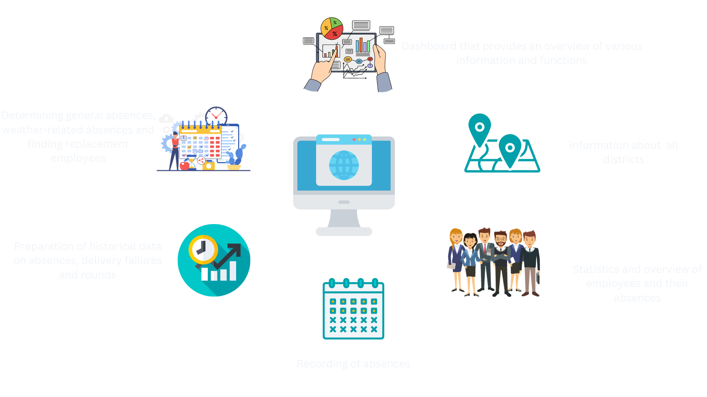

# Multiple time series analysis for Main-Post employee outages

Postal carriers are the backbone of last-mile logistics. However, due to the increased volume of deliveries, changing weather conditions and the often high workload, postal carriers are significantly affected by sick days and absences. In collaboration with the Main-Post media group, we have developed a data-driven tool for analysing and predicting absences.
 
Our application makes it possible to predict the cancellations of the Main-Post delivery staff. To do this, historical cancellations as well as historical and future weather data are taken into account. The optimisation framework can also be used to determine the best possible replacement for missing employees.
 
 
**The following visualisation gives an overview of the functionalities of our application:**
 
 

 
 
The objective of this project documentation is to provide an overview of our application as well as a deeper insight into the structure of the application. This documentation explains the tools and technologies used and how we technically implemented the individual components. 
 
 
**Our project documentation consists of the following components:**
 

    <figure>
        
        <figcaption>Project Setup</figcaption>
    </figure>
    <figure>
        
        <figcaption>Architecture</figcaption>
    </figure>
    <figure>
        
        <figcaption>Data Overview</figcaption>
    </figure>
    <figure>
        
        <figcaption>Services</figcaption>
    </figure>
    <figure>
        
        <figcaption>Web Application</figcaption>
    </figure>
    <figure>
        
        <figcaption>Backend</figcaption>
    </figure>

