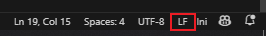

# <i class="fas fa-wrench"></i>  Installation


<i class="fab fa-docker"></i><span style="margin-left: 20px;">Make sure you have docker desktop installed on your local machine</span><br>

- Minimum of 6GB Memory allocated in Docker Desktop and 25 GB of free Diskspace (Open Docker Desktop -> Settings -> Resources)

<i class="fab fa-github"></i><span style="margin-left: 20px;">You need a GitHub account</span>


## Project Setup

### Github Repositories

<span style="margin-left:20px;">Clone our Github Repository:</span>

<details open>
<summary>HTTPS</summary>

```
git clone https://github.com/UHPDome/backend_mainpost.git

```
</details>

<details>
<summary>SSH</summary>

```
git clone git@github.com:UHPDome/backend_mainpost.git

```
</details>

---

### Edit .env.example

```
VUE_APP_SUPABASE_KEY=value
VUE_APP_MAPBOX_API_TOKEN=value
```
<span style="margin-left:20px;">The corresponding file can also be found in <a href="https://github.com/UHPDome/backend_mainpost/tree/main/frontend" target="_blank">/frontend</a></span>


--- 
### Project directory

<span style="margin-left:20px;">Navigate into the project directory:</span>
```
cd backend_mainpost
```
### Start Docker Container

<span style="margin-left:20px;">Start the Docker containers:</span>
```
docker-compose up
```
---


<strong>Note:</strong>

- initial build can take up to 30 minutes
- we ran into problems while building in the eduroam network because of firewall and proxy policies
- If you are on a Windows Machine, use VSCode
- If you want to enable cron scheduling you have to change the crontab from CLRF to LF. You can do this by clicking on the icon on the bottom right corner:



---


### docker-compose.yml

<details open>
<summary>Edit setup in docker-compose.yml file</summary>

```
version: "3.9"
services:
  update_predictions:
    container_name: 'dockerized-update-predictions'
    build:
      context: .
      dockerfile: ./docker/development/Dockerfile.execute  
    volumes:
      - ./development/src:/code
    depends_on: 
      - mlflow
    environment:
      - MLFLOW_TRACKING_URI=http://host.docker.internal:5001
    #extra_hosts:
    #  - "host.docker.internal:host-gateway"
  fastapi:
    build:
      context: .
      dockerfile: ./docker/backend/Dockerfile
    ports:
      - "8000:8000"
    volumes:
#      - ./app:/app
      - .:/app
  mlflow:
    build:
      context: .
      dockerfile: ./docker/mlflow/Dockerfile  # Verweisen Sie auf das oben gezeigte Dockerfile
    ports:
      - "5001:5001"
    volumes:
      - ./development/src/mlruns:/mlflow/mlruns
      - ./development/src/mlartifacts:/mlflow/mlartifacts
  frontend:
    container_name: 'dockerized-mainpost-frontend'
    build: 
      context: ./
      dockerfile: './docker/frontend/Dockerfile'
    stdin_open: true
    tty: true
    ports:
      - "8080:8080"
    volumes:
      - ./frontend:/app/frontend
      - /app/frontend/node_modules
    environment:
      - CHOKIDAR_USEPOLLING=true
  #cronjob:
  #  container_name: 'dockerized-cronjob'
  #  build:
  #    context: .
  #    dockerfile: ./docker/development/Dockerfile  # Verweisen Sie auf das oben gezeigte Dockerfile
  #  ports:
  #    - "7000:7001"
  #  volumes:
  #    - /etc/timezone:/etc/timezone:ro # sync time zone with host machine
  #    - /etc/localtime:/etc/localtime:ro
  #    - ./development/src:/code

```
</details>


